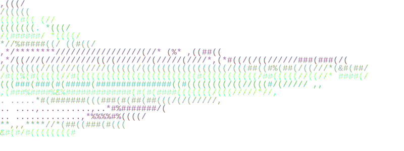

<p align="center">
  
</p>
<h1 align="center">BLÅHAJ-rs</h1>
<h4 align="center">Gay sharks at your local terminal</h4>

## What is BLÅHAJ-rs?

This Program is a Rust port of the CLI tool [BLAHAJ](https://github.com/GeopJr/BLAHAJ).  
The original program was written in Crystal, which to my knowledge has no way to flush I/O. That is annoying. The obvious solution was to write it in rust.

## Compilation

```console
$ git clone https://github.com/yoshisaac/BLAHAJ-rs.git
$ cd BLAHAJ-rs
$ cargo build --release
$ cargo run --release
```

## Installation

Soon™

## Showcase


## License

Seriously? It's the [MIT license](LICENSE).
